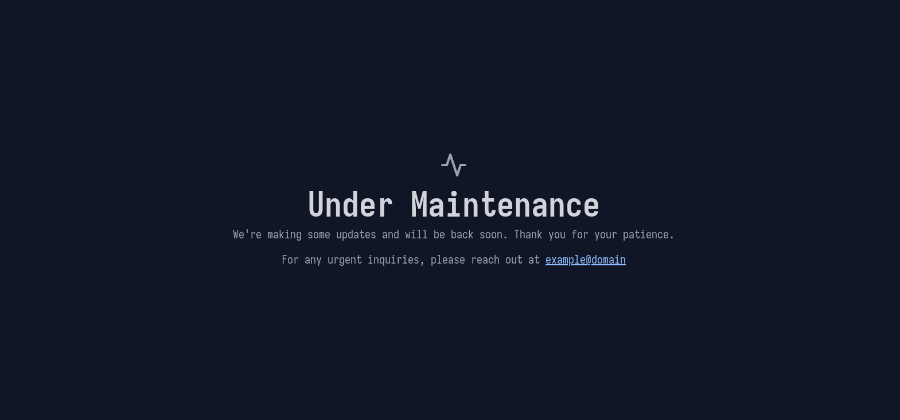

# maintenance

launch a maintenance page from a single executable

## usage

```bash 
cd maintenance

go build .

./maintenance -p <port to show page> #requires .env to be at the same location as the executable

 
#or 
EMAIL=example@domain ./maintenance -p <port to show page> 
```

## Screenshots

